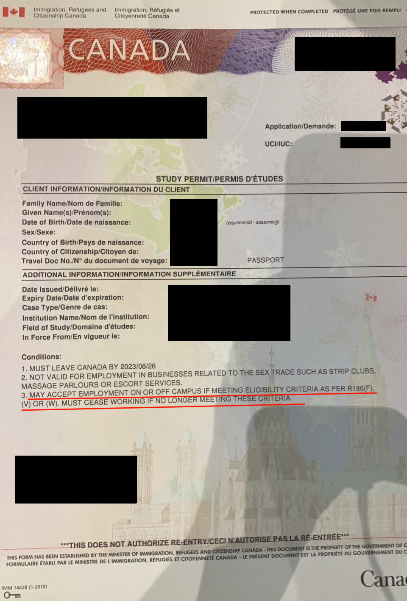
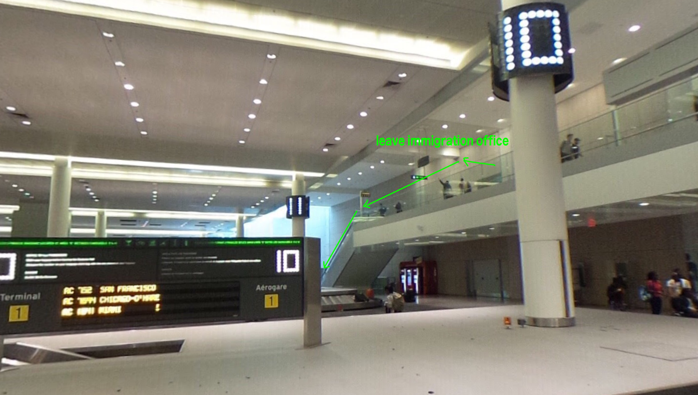
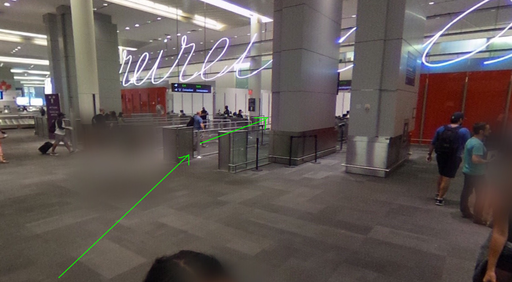
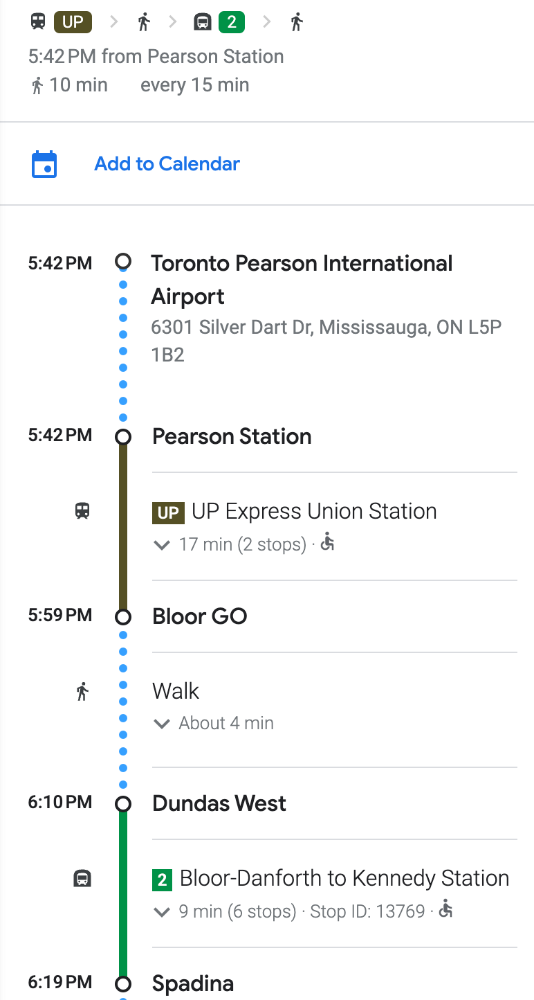

# 入境加拿大

在加拿大機場下飛機後，就準備好要進入入境了。我將入境流程大致上分為以下幾個步驟：
1. [取得你的學生簽證/出關](#1-取得你的學生簽證出關)
3. [前往住處](#2-前往住處)
4. [Move-in](#3-move-in)

## 1. 取得你的學生簽證/出關
學生簽證是你在這趟交換期間的重要證件，它會影響你的學生身份、打工許可、以及你的保險等等。甚至關乎到你是否能夠取得獎學金，因此請仔細確認你的學生簽證符合要求：

圖

上圖紅線處，必須要有以下條款，如果沒有，請立即向 officer 反應: 

$$
\begin{aligned}
&\color{orange}{\text{May Accept employment on or off campus if meeting eligibility criteria as per R186(F), (V) OR (W). }} \\
&\color{orange}{\text{Must cease working if no longer meeting these criteria.}}
\end{aligned}
$$

### 需要的文件：
- [Letter of Introduction](../preprocess/cn.md#letter-of-introduction)
- Letter of Acceptence of UofT
- 其他所有有助於審核的文件，如：
    - Mitacs 獎學金許可信
    - [住宿地點的文件](https://docs.google.com/document/d/1CFSxC2TjOoTddmoWhA5jlE7J8b7gOU_pFDTaKe20tj4/edit?usp=sharing)

### 流程
1. 先在入境前的機台操作核對護照與拍照取得入境單
2. 入境過海關時跟一般的 `Officer` 說你要辦理 `Study Permit`，$\color{red}\text{注意不要以eta入關了}$
3. 他們會在你的入境單上畫上粉紅色X，並指示你前往辦理工作與學生簽證櫃檯(地面上會有粉紅箭頭指示) 
4. 可能會有其他人在排隊，等待 officier 叫號上前
5. Officier 開始問問題，主要會問說你的申請學生簽證的目的、你預計待多久、你上的課程叫什麼以及內容、是否有需要 Off-cumpus 的打工許可 *(建議預練一下，你不會想要讓對方誤解你的意思)*
    - 要注意如果按照多倫多大學提供的文件上的日期是否與你真實要待的時間一致，若有不同需要特別跟 officier 說會待更久，以免後續期間到被要求出境
    - 通過後他們會在你的入境單上畫個圈圈
6. 通過後就會拿到你正式的 study permit 了！ 要注意 **日期** 跟 **off-campus 打工許可**，有問題要立即反應，離開這邊你很難再次進入
7. 最後，下樓領托運行李、將入境單交給出口處的人員就可以成功入關了 
    

    [360º實景](https://goo.gl/maps/suC82ogJtkPQyjxV8), 
    動線：
    
    

    

## 2. 前往住處
- 在出境大廳先找 PRESTO(多倫多的悠遊卡) 機台，長得像這樣：
:format(jpeg)/cloudfront-us-east-1.images.arcpublishing.com/tgam/I6NQLVKI2ZJUNB2RWRGITNBRFU.jpg)
- 買 PRESTO 卡，我是買 $26 元 (卡片6元 + 20 元儲值)
    
- 之後的路徑圖如下：
    
- 上二樓(不確定樓層，樓梯就在 PRESTO 機台旁) 過天橋搭乘 UP Express 到 Bloor Go (用 PRESTO 卡刷卡)
- 找 Dundas West Station，進站後到地下室，搭往 Kennedy 方向搭到 Spandina
- 之後就可以一路走到住宿了

## 3. Move-In
- 進入住宿後，先去前台拿鑰匙，拿 passport 給櫃檯人員，他們會幫你辦理 move-in.
- Enjoy your stay!