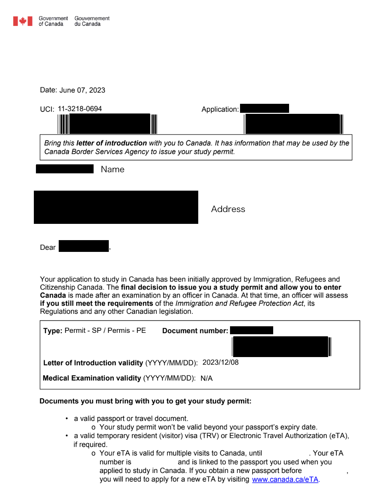
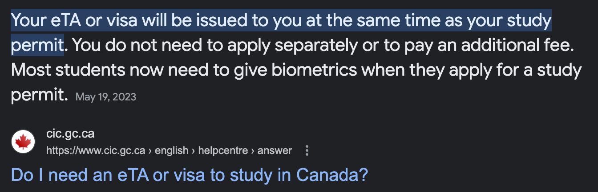
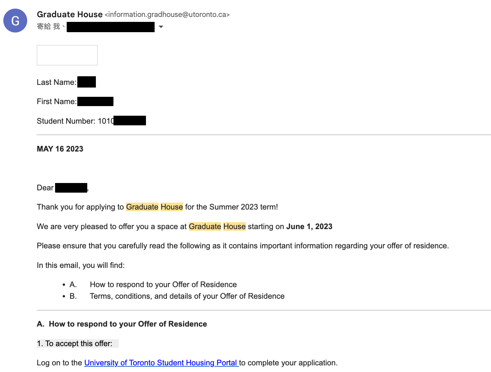
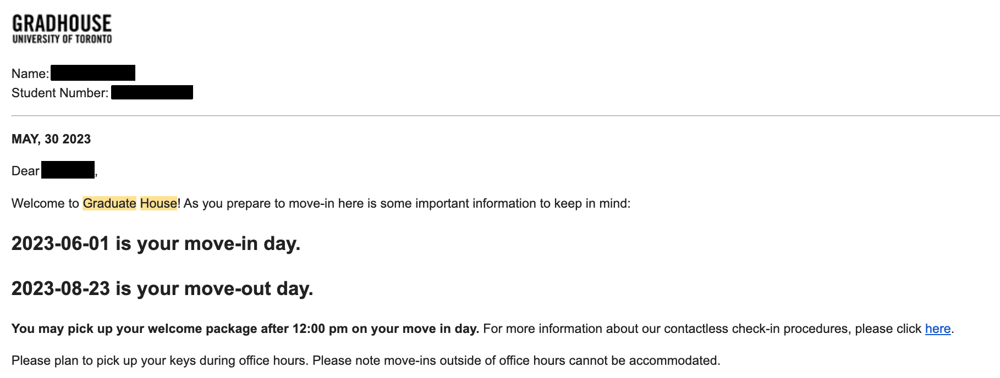
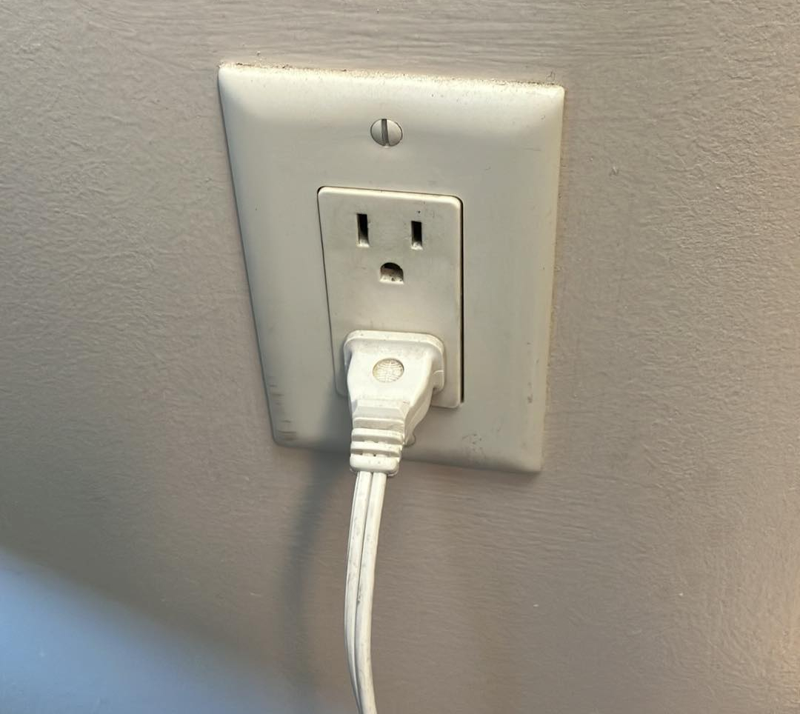

# 行前準備

在出發前往加拿大前，你需要先完成以下事項：
1. [申請簽證](#1-申請簽證)
2. [購買機票](#2-購買機票)
3. [尋找住宿](#3-尋找住宿)
4. [準備行李](#4-準備行李)

## 1. 申請簽證

### Apply for a Study Permit
申請學生簽證允許學生於加拿大進行6個月以上的學程。正常情況下若是6個月以下的學程只需要以旅遊簽形式 i.e. eTA。然而本次 IEH 涉及 on/off campus work，故仍需要申請學生簽證允許正式工作。

學生簽證允許 on-campus work，與 20 hours off-campus work。相關規定可見。（在規定上其實還有細分 6 個月以上/下能做的不同，但實務上海關在發簽證不會分那麼細，以還是會與你討論實際內容後再核發細項）
- [On & Off Campus Work - Centre for International Experience](https://internationalexperience.utoronto.ca/international-student-services/immigration/working-in-canada/on-off-campus-work/)
- [Work off campus as an international student - Canada.ca](https://www.canada.ca/en/immigration-refugees-citizenship/services/study-canada/work/work-off-campus.html)

另外 Study Permit 也影響 [Social Insurance Number](https://www.canada.ca/en/employment-social-development/services/sin.html) (SIN) 的申請。SIN 提供稅務追蹤的功用，而需要 SIN 才可收受薪資抑或獎學金（須報稅）。

學簽平均申請時間約為 7 週（可參考此[網址](https://www.hellostudy.com.tw/why-hello-study/resources/documents/23977/permits-processing-times/)）

#### Letter of Introduction

這封信是你在入境時，跟海關人員申請學生簽證的重要文件。 $\color{red}\text{是行前準備最重要的一環，越早申請越好}$， 一但延後你可能機票要延後，住宿要延後，甚至要延後整個Program。

#### 申請流程
- 註冊並登入 [IRCC Portal](https://portal-portail.apps.cic.gc.ca/signin?lang=en)
- 點選 $\color{blue}{\text{Apply for a visitor visa, transit visa or a study permit}}$
- 依據 IRCC 網站指示，填寫表格並送出申請並付款
- 等待核可信件

### 加拿大旅行簽證 Electronic Travel Authorization (eTA)
- [申請網址](https://www.canada.ca/en/immigration-refugees-citizenship/services/visit-canada/eta.html)
- 體感上很快就會核可(個人經驗20分鐘)，但是還是建議越早申請越好
- 申請後會綁定在你的護照號碼上，如果在搭機前沒有 eta，你會被地勤人員擋下來
- 雖然 [letter of introduction](#letter-of-introduction) 上寫說會在入關時一起發給你 study permit 與 eta (如下圖)
- $\color{red}\text{但是還是建議先申請好eta\, 不然你在搭機時會一直被詢問為何沒有 eta\, 有被延誤的風險}$
    

### 轉機國家旅行簽證
- 有些國家在轉機時需要申請旅行簽證，例如：美國轉機時等同入境，所以需要申請 [ESTA](https://esta.cbp.dhs.gov/esta) 。
- 請確保你的轉機國家是否需要申請旅行簽證。
- 體感上很快就會核可(個人經驗20分鐘)，但是還是建議越早申請越好。如果你真的忘記，在搭機前趕快用機場網路申請，可能會有機會在搭機前核可。

## 2. 購買機票
- 請確認你的 [letter of introduction](#letter-of-introduction) 上的 $\color{red}\text{Start Date}$，並在此日期後前往加拿大。
- 你可以根據你的學簽申請日 + 預計處理時間去推估你的學簽大概多久會核可，來決定你所購買的出發日期。
- 建議申請到學簽再買機票
- 直航通常較貴，可以選擇多次轉機的機票，但是請確保你的轉機國家是否需要申請旅行簽證。
- 同時購買來回機票通常會比較便宜。

## 3. 尋找住宿
- 我們會使用 [UofT校內的住宿系統](https://starportal.utoronto.ca/StarRezPortalX/17114769/1/1/Home-StarRez___University?UrlToken=A81613AE) 來尋找住宿，因為時間點特殊所以不見得會有住宿，請參考 [住宿資訊](https://starportal.utoronto.ca/StarRezPortalX/9CD7C4D3/13/120/The_Residences-The_Residences?UrlToken=1D790EA8) 多家一起申請比較有機會。 
- 申請時會需要繳交 `$100 加幣` 的申請費，如果沒有住宿，會退還費用。一次費用可以進行多次不同住宿的申請。
- 當住宿核可時，會收到 `Offer of Residence` (如下圖)，登入系統繳交保證金後，等待後續 `Move-In Information。
    
    

    - 特別注意一下你的 $\color{red}\text{Start Date}$，有很大機率會跟你當初申請的日期不同，你可以嘗試去跟住宿系統的人員溝通，但是不見得會成功。
- 收到 `Move-In Information` (如下圖)就可以開始準備行李了。

          
    
## 4. 準備行李
若抽中宿舍，可先確認宿舍提供物決定打包內容（i.e [Moving In - Graduate House at University of Toronto](https://gradhouse.utoronto.ca/moving-in/)）
#### 行動網路
- 支援 esim 的手機(e.g. iphone SE)
- esim網卡
- [esim卡使用教學](./assets/esim.jpg)

#### 生活用品
宿舍裡面沒有枕頭與棉被，因此會需要帶或者買：
- 枕頭
- 棉被/睡袋/床墊套
基本上宿舍也沒有提供餐具或廚具，也需要自己準備
- 餐具(筷子、湯匙、叉子...)
- 碗等容器
- 廚具(平底鍋、鍋子...)

#### 衣物相關
- 多倫多日夜溫差頗大，因此會需要準備一套較保暖的衣物
- 襪子
- 雨傘
- 外出上衣
- 室內上衣
- 內褲
- 拖鞋
- 運動鞋
- 帽子

#### 洗漱用具/清潔用具
- 吹風機 (住宿不見得會提供，可以在你住宿的官網上確認)
- 浴巾/毛巾 
    - 相對不好買，建議先帶
- 肥皂/洗髮乳
- 牙刷/牙膏
- 洗碗精/菜瓜布

#### 電子設備
- 電腦
- 平板
- 行動電源(切勿託運, 且限100wh以下)
- 充電器(手機、相機、電腦)
- 各式轉接頭(可以帶110V的多孔轉接頭)
- 相機
    - 電池
    - 鏡頭
- 延長線(跟台灣一樣都是 110V/120V )，插座如圖：

    
    
#### 金錢相關
- VISA 信用卡/金融卡: 目前感覺唯一需要的，加拿大/美國的店大多可以直接刷
    - 手續費也不會說太貴，可以衡量一下要帶多少現金，目前感覺1500就很多了
        - e.g. \$26 加幣用 `Linebank` 刷是 604 台幣
- 在加拿大收 100, 50 紙鈔的商家不多，要特別去超商/銀行換
