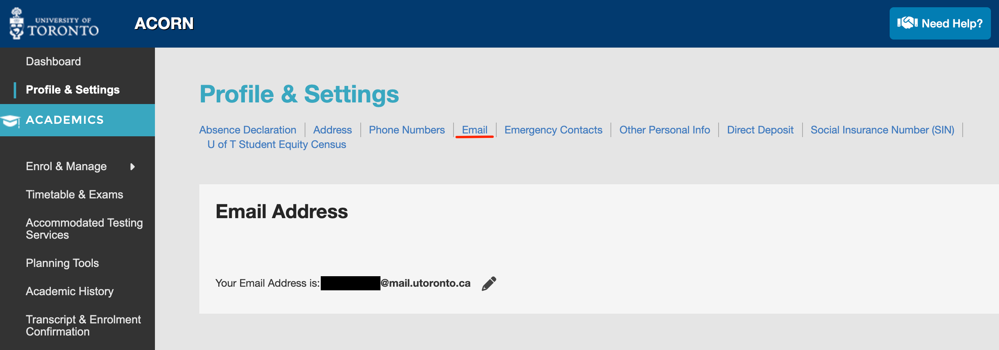

# 申請UofT必要文件
安置好住處後，接下來就是申請UofT必要文件。這些文件包含了學生證、社會保險號碼、銀行帳戶等等。這些文件的申請流程都很簡單，但是需要一些時間等待。所以建議在入境後的第一個禮拜就開始申請。

根據優先度申請順序如下：
1. [取得學生證 (UTORid & TCard)](#1-取得學生證-utorid--tcard)
2. [啟用 ARCORN 與學生健康保險 UHIP](#2-啟用-arcorn-與學生健康保險-uhip)
3. [取得社會保險號碼 (SIN)](#3-取得社會保險號碼-sin)
4. [開設銀行帳戶](#4-開設銀行帳戶)

## 1. 取得學生證 (UTORid & TCard)
由於學生宿舍網路需要 `UTORid` 才能使用，所以申請學生證是第一步。

### 請導師 Supervisor 申請訪客用 UTORid
請導師 Supervisor 由此[入口](https://www.utorid.utoronto.ca/cgi-bin/utorid/sponsor.pl) 申請訪客用 UTORid (有效期限5天)。申請完後請導師將 UTORid 寄給你。即可使用 UTORid 登入學生宿舍網路 UofT。

### 申請 TCard 與 UTORid
#### 所需文件
- 照片/學生簽證/護照

- https://tcard.utoronto.ca/get-your-utorid-tcard/ 

照著網站流程跑，大概2個工作天就能拿到 UTORID 和學生證

#### 取得實體 TCARD
- 登入 [CLNX(Career & Co-Curricular Learning Network System)](https://clnx.utoronto.ca/students/overview.htm)
- 預約你的取卡時間後，到 TCARD office 領取學生證
- 完成！
    
    

## 2. 啟用 ARCORN 與學生健康保險 UHIP
- [ARCORN](https://www.acorn.utoronto.ca/) 是 UofT 的學生系統，可以查詢課程、成績、繳費等等。帳號密碼與你設置的 UTORID 相同。
- 當啟用 ARCORN 後，請確保 ARCORN 的 email 已經與 Umail 連結。這樣才能收到 UHIP 的通知。
    

#### 取得學生健康保險 UHIP
我也還沒拿到，不知道何時...

## 3. 取得社會保險號碼 (SIN)

雖然可以線上申請，但實際去你最近的 `Service Canada` 據點跑一趟是最快的。
- 請攜帶護照、學生簽證、UofT 錄取信、居住地資料 前往
- 這時候如果學生簽證沒有 [May Accept employment on ...](../entry_canda/cn.md#1-取得你的學生簽證出關) 條款的話，你會直接被告知無法申請 SIN。
- 取得後你就得到一張紙條，上面有你的 SIN，請妥善保管。之後領取獎學金會用到。

## 4. 開設銀行帳戶
- [UofT銀行開戶建議](https://internationalexperience.utoronto.ca/international-student-services/resource-and-information-hub/finances/?fbclid=IwAR1sUd23z7cux0rFv4JgfMjHYq0BsPfzrR9t0m3zYC9pWxOa6LLeUg43hKY#:~:text=What%20documents%20are%20needed%20to,if%20you%20are%20applying%20online)
- 攜帶護照、學生簽證、UofT 錄取信、居住地資料 前往。

- 個人推薦在 `777 BAY ST` TD Bank 開戶，態度親切且有中文服務。
    [預約網址](https://www.td.com/ca/en/personal-banking/contact-us)
- 因為我們交換時間很短，所以理論上只會開 Chequing Account。 但如果你有需要的話，也可以開 Saving Account。

